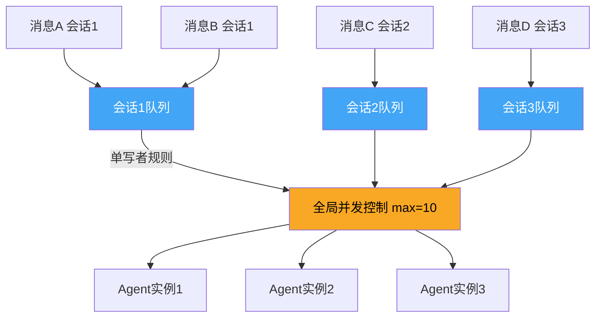

---
tags:
  - 架构
  - 并发
  - OpenClaw
aliases:
  - Lane-Based Queuing
  - 车道式排队
  - 并发模型
---

# Lane-Based Queuing 并发模型

Lane-Based Queuing（车道式排队）是 [[OpenClaw 是什么|OpenClaw]] 的并发控制核心，解决"多条消息同时到达时如何保证一致性"的问题。它是多频道消息架构下会话管理的关键基础设施。

## 核心不变量：单写者规则

> **One agent run per session at a time.**（每个会话同一时间只能有一个 Agent 运行实例）

这是整个并发模型的基石——避免两个 Agent 实例同时修改同一会话的状态。这与 [[上下文管理机制]] 中维护一致性的要求直接相关。

## 两阶段队列

1. **Per-Session Lane**：每个会话拥有独立队列，保证同一会话内的消息按序处理
2. **Global Lane**：全局并发控制（`maxConcurrent` 配置，默认 10），防止系统过载

## Queue Modes

| Mode | 行为 | 适用场景 |
|------|------|----------|
| **collect**（默认） | 新消息收集到队列末尾，等待当前执行完成 | 普通聊天消息 |
| **followup** | 排队等待当前执行完成后作为后续指令执行 | 补充说明、追加要求 |
| **steer** | 在 tool boundary 抢占当前执行 | 用户说"停下来，换个方向" |
| **steer-backlog** | 类似 steer 但保留被中断的任务到 backlog | 紧急插入但不丢弃原任务 |
| **interrupt** | 立即中断当前执行 | 紧急停止 |

**`steer` 模式是关键创新**：不是粗暴地 kill Agent 进程，而是在 tool boundary（两次[[Tool Use 机制|工具调用]]之间的间隙）优雅地抢占——让 Agent 完成当前工具调用，然后转向新指令。这是[[自主决策循环]]中人在回路控制的关键机制。

## 传输保障

- **入站去重**：相同消息在短时间窗口内只处理一次
- **防抖（Debounce）**：快速连续的消息合并为一次处理
- **幂等键**：关键操作携带幂等键，确保重试安全

## 相关笔记

- [[Agent Execution Loop]]
- [[自主决策循环]]
- [[Tool Use 机制]]
- [[消息路由]]

## 参考

- [OpenClaw GitHub](https://github.com/anthropics/openclawx)
- [MCP 规范](https://modelcontextprotocol.io)
