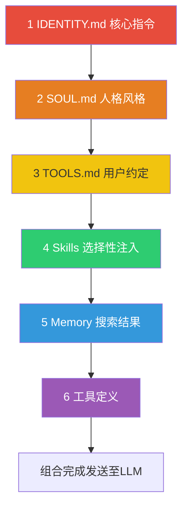

---
tags:
  - 架构
  - 系统提示
  - prompt-engineering
aliases:
  - System Prompt
  - 系统提示词
  - 提示词设计
---

# System Prompt 设计

System Prompt 是 AI Agent 行为的基础定义，决定了 Agent 的身份、能力边界和行为规范。在 [[OpenClaw 是什么|OpenClaw]] 中，系统提示通过多层文件组合构建，是提示工程的核心实践。

## 提示组合顺序

[[Agent Execution Loop]] 的 Phase 3（Context Assembly）中，提示按以下顺序组合：

1. **IDENTITY.md / AGENTS.md** -> 核心指令（不可违反的规则）
2. **SOUL.md** -> 人格/语气（"The claw is the law"）
3. **TOOLS.md** -> 用户特定约定
4. **Skills（选择性注入）** -> 仅注入相关技能，避免 Token 膨胀
5. **Memory 搜索结果** -> [[记忆系统|语义相关的历史上下文]]，通过向量嵌入与混合搜索检索
6. **工具定义** -> 自动从内置工具和插件注册生成

## 设计要点

### 分层职责

- **IDENTITY.md**：定义 Agent 的核心身份和不可违反的约束，是安全边界的第一道防线
- **SOUL.md**：定义人格和语气风格，赋予 Agent 独特的交互体验
- **TOOLS.md**：用户自定义的操作约定和偏好

### Skills 选择性注入

系统不会将所有可用 Skill 都注入 prompt，而是根据当前对话的语义相关性**选择性注入**，以控制 Token 消耗。这是上下文管理机制的重要策略。

### 工具定义自动生成

[[Tool Use 机制|工具定义]]从内置工具和已安装插件的注册信息自动生成，无需手动维护 prompt 中的工具列表。

## 安全考虑

System Prompt 中的核心指令（IDENTITY.md）是防止 Agent 越界行为的关键。然而，Compaction 机制可能在压缩过程中意外丢失安全指令——这正是 Meta AI 安全总监邮箱事件的原因之一。同时，[[Prompt Injection 风险|提示注入攻击]]可能试图覆盖 System Prompt 中的安全规则。

## 相关笔记

- [[Agent Execution Loop]]
- [[上下文管理机制]]
- [[Prompt Injection 风险]]
- [[JSON Schema]] — 工具定义自动生成时使用 JSON Schema 描述参数结构

## 参考

- [OpenClaw GitHub](https://github.com/anthropics/openclawx)
- [Anthropic Prompt Engineering 指南](https://docs.anthropic.com/en/docs/build-with-claude/prompt-engineering)
