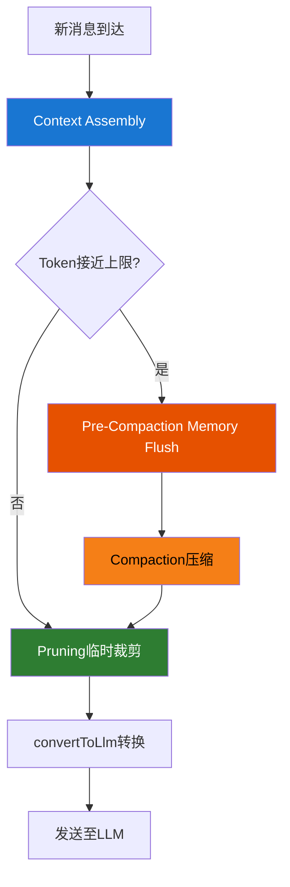

---
tags:
  - 架构
  - 上下文管理
  - 记忆
aliases:
  - Context Management
  - 上下文管理
  - Compaction
  - Pruning
---

# 上下文管理机制

上下文管理是 AI Agent 系统中最关键的工程挑战之一。由于 LLM 存在固定的 Token 窗口限制，Agent 必须在有限空间内组装最相关的信息。[[OpenClaw 是什么|OpenClaw]] 在这方面的设计尤为精细。

## 上下文管理决策流



## Context Assembly（上下文装配）

在 [[Agent Execution Loop]] 的 Phase 3 中，系统执行以下步骤：

1. 加载会话历史
2. 组合[[System Prompt 设计|系统提示]]
3. 搜索相关[[记忆系统|记忆]]
4. 注入技能

## Compaction 与 Pruning

这是两个容易混淆但截然不同的机制：

| 机制 | 触发时机 | 作用 | 持久性 |
|------|----------|------|--------|
| **Compaction** | 上下文接近 Token 上限 | 将对话历史压缩并持久化到 JSONL 文件 | 永久写入磁盘 |
| **Pruning** | 每次 LLM 调用前 | 临时裁剪上下文以适配模型窗口 | 仅影响当次调用，不改变存储 |

### Compaction 核心流程

1. 先将关键信息写入持久化记忆（"write durable notes before compacting"）
2. 然后压缩旧对话

### Pre-Compaction Memory Flush

在 Compaction 执行前，系统会触发一个**自动 agentic turn**——Agent 先审视即将被压缩的上下文，将重要信息主动保存到 MEMORY.md 或每日笔记中，然后再执行压缩。这是一种"临终遗言"机制，确保关键上下文不会随压缩消失。

### 已知限制

- Compaction 本质上是**有损压缩**，无法保证 100% 信息保留
- 大型记忆文件（MEMORY.md 超过数千行）可能在压缩过程中被改写、截断甚至部分丢弃
- 多轮复杂对话中的隐含上下文在压缩后可能丢失语义连接
- **安全风险**：压缩过程意外删除安全指令——这是 Meta AI 安全总监邮箱被清空的原因，属于 [[Prompt Injection 风险]] 的变体

## Message Pipeline 中的上下文变换

在 Pi Agent Core 的 Message Pipeline 中：

```
AgentMessage[] -> transformContext() -> convertToLlm() -> LLM Provider
```

`transformContext()` 负责上下文变换——注入记忆、裁剪历史、应用 Pruning。

## Claude Code 与 OpenClaw 的上下文管理对比

- **Claude Code**：会话内上下文 + Compaction，无跨会话持久记忆
- **OpenClaw**：跨会话持久记忆 + 向量检索 + Compaction + Pruning，数据存储在 SQLite 中

## 相关笔记

- [[Agent Execution Loop]]
- [[记忆系统]]
- [[System Prompt 设计]]

## 参考

- [OpenClaw GitHub](https://github.com/anthropics/openclawx)
- [Anthropic 官网](https://anthropic.com)
