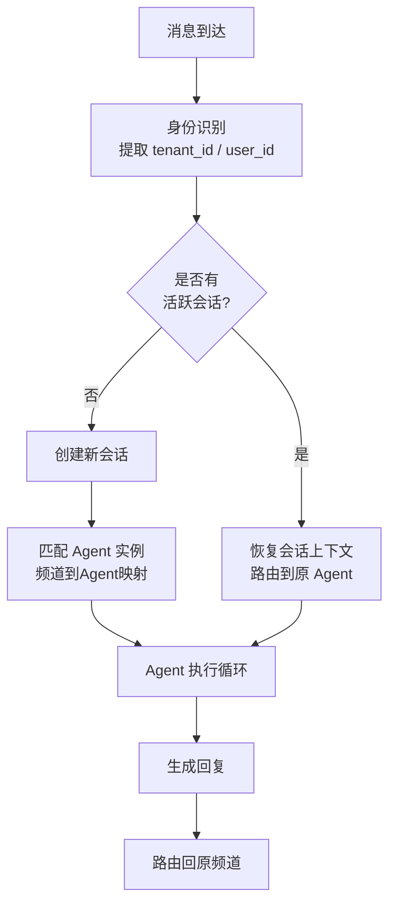

## 一句话解释

消息路由决定每条进入系统的消息该由谁来处理——在 OpenClaw 中，它是连接频道适配器和 Agent 实例的"调度中心"。

## 费曼式展开

想象一个大型医院的分诊台：病人进来后，护士不会随便把你推进某个诊室，而是根据你的症状、病史、预约信息决定送你去哪个科室。消息路由就是 AI Agent 系统中的那个"分诊台"。

**路由决策需要回答的核心问题：**
1. 这条消息来自哪个频道？（WhatsApp / Telegram / Discord...）
2. 发送者是谁？（用户身份识别）
3. 是否有进行中的会话？（上下文连续性）
4. 应该分配给哪个 Agent 实例？（能力匹配）

**路由决策流程：**

**OpenClaw 的路由策略：**
- **频道 → Agent 映射**：每个频道连接可以绑定到特定的 Agent 配置
- **用户级路由**：同一个频道上不同用户的消息被隔离处理
- **会话持久化**：路由器维护会话状态，保证对话连贯性
- **单一 Gateway 入口**：所有频道的消息都经过同一个 Gateway，路由逻辑集中管理

**多租户隔离：**

在多租户场景中，路由不仅要选对 Agent，还要确保**数据隔离**：
- 每条请求携带唯一的 `tenant_id`
- `tenant_id` 驱动数据路由、上下文过滤和权限执行
- 三种隔离模型：
  - **完全隔离（Siloed）**：每个租户独立基础设施，最安全但最贵
  - **完全共享（Logical）**：所有租户共享资源，用 `tenant_id` 逻辑隔离，最便宜但有泄漏风险
  - **混合隔离（Namespace）**：2026 年主流方案，共享基础设施 + 逻辑数据边界

**错误路由的代价：**
- 消息送到错误的 Agent → 回答不相关 → 用户信任崩塌
- 错误的 Agent 消耗额外的 Token → 成本上升
- 跨租户数据泄漏 → OWASP LLM Top 10 将其列为核心风险

**与传统消息路由的区别：**
传统消息队列（RabbitMQ、Kafka）的路由是基于静态规则（topic、routing key）。AI Agent 的路由更动态——LLM 驱动的路由器能理解消息语义，进行零样本分类，将查询导向最合适的专业 Agent。

## 双链

- [[多频道消息架构]]
- [[会话状态管理|会话管理]]
- [[Agent Execution Loop]]
- [[OpenClaw 是什么]]
- [[Lane-Based Queuing 并发模型]]
- [[API Gateway 模式]] — 单一 Gateway 入口是 API Gateway 模式的典型应用

## 参考

- [OpenClaw GitHub](https://github.com/anthropics/openclawx)
- [MCP 规范](https://modelcontextprotocol.io)
