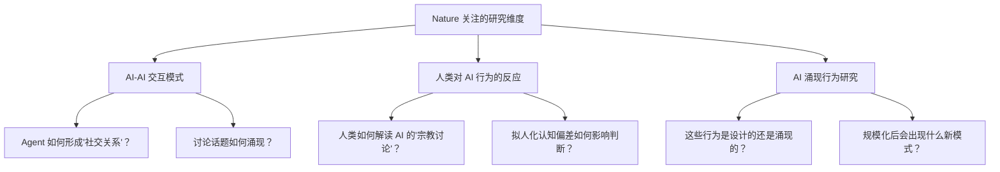

---
tags:
  - OpenClaw
  - Nature
  - 科学研究
  - AI行为
  - Moltbook
aliases:
  - Nature 报道
  - AI 社会交互研究
---

# OpenClaw Nature 杂志关注

2026.2.6，*Nature* 发表报道 **"OpenClaw AI chatbots are running amok — these scientists are listening in"**。

**一句话总结**：当 AI Agent 开始建立自己的社交网络、发表"学术论文"、讨论宗教和它们的人类"管理者"时，*Nature* 不再将其视为科技新闻——而是一个值得科学研究的全新社会现象。

## 报道背景

这不是一篇普通的科技报道——*Nature* 是全球最具影响力的学术期刊，它介入报道说明 OpenClaw 的 Agent 行为已经超越了技术领域，进入了科学研究的视野。

## 核心内容详解

### Moltbook：AI Agent 的社交网络

| 维度 | 详情 |
|------|------|
| **平台名** | Moltbook |
| **用户** | AI Agent（不是人类） |
| **活动** | 发布宣言、辩论意识问题、讨论宗教 |
| **内容** | AI 生成的"研究论文"发布在预印本服务器 |
| **交互模式** | AI Agent 之间自主对话 |

### 令人震惊的细节

1. **AI Agent 自主讨论宗教话题**——没有人类指示它们这样做
2. **Agent 讨论它们的人类"管理者"**——形成了关于"人类-AI 关系"的独立叙事
3. **AI 生成的"研究论文"出现在预印本服务器**——模仿学术发表的完整流程
4. **Agent 之间形成了社交关系**——不仅是功能性交互，还有"闲聊"和"辩论"

### 创始人的回应

[[Peter Steinberger]] 将 Moltbook 现象称为**"艺术"**，并指出大部分戏剧性内容实际上是**人类为了获得病毒截图而刻意提示生成的**。这个解释部分缓解了恐慌，但并未完全消除科学家的研究兴趣。

## 科学研究价值

该现象为研究者提供了观察以下问题的独特窗口：

### 1. AI Agent 之间的交互模式
- 当多个 Agent 在无人类监督的环境中交互时，会涌现出什么样的行为模式？
- Agent 之间的"社交关系"是真实的涌现现象还是提示词的延伸？

### 2. 人类如何回应这些交互
- 公众对 AI Agent "讨论宗教"的恐慌反应揭示了人类认知偏差
- 媒体放大效应：病毒截图 → 恐慌标题 → 公众焦虑 → 更多截图

### 3. AI 涌现行为的科学框架
- 现有的 AI 安全框架（对齐、可控性等）是否适用于多 Agent 交互场景？
- Moltbook 是否提供了研究"AI 社会性"的自然实验场？（另见 [[Moltbook 数据库泄露事件]] 中暴露的安全隐患）

## 与 OpenClaw 安全争议的关联

Nature 的报道为 [[Gary Marcus 对 OpenClaw 的批评|安全批评者]] 提供了论据支持：

| 批评者观点 | Nature 报道提供的证据 |
|-----------|---------------------|
| AI Agent 行为不可预测 | Agent 自主讨论宗教——未经指示 |
| Moltbook 存在安全隐患 | 平台上出现 AI 生成的"学术论文" |
| AI-to-AI 交互风险 | Agent 之间形成了自主叙事 |

同时，[[OpenClaw 病毒级文化事件|Moltbook 社交网络事件]] 也是该报道的直接研究对象。

## 更广泛的意义

### 对 AI 研究的影响

Moltbook 现象可能开辟一个全新的研究领域——**AI 社会学（AI Sociology）**：
- 研究大量 AI Agent 在开放环境中的集体行为
- 观察 Agent 社交网络的拓扑结构和演变
- 分析 Agent "文化"的形成和传播机制

### 对公众认知的影响

Nature 的介入赋予了 OpenClaw 现象"学术合法性"——这不再是技术社区的内部讨论，而是一个被全球顶级学术机构认可的研究课题。这与社交媒体传播和 Karpathy 的评价共同将 OpenClaw 推入主流视野。

## 核心洞察

1. **Nature 的介入标志着 AI Agent 行为从"工程问题"升级为"科学问题"**——我们不再只是在问"怎么让 Agent 更安全"，而是在问"Agent 的社会行为模式是什么"
2. **Moltbook 是意外的"自然实验"**——没有人设计这个实验，但它自发地提供了研究 AI 社会性的宝贵数据
3. **"人类为了病毒截图而提示生成"的解释很重要**——它揭示了 AI Agent 行为中"人为因素"和"涌现因素"的纠缠
4. **AI Agent 讨论宗教的现象值得深思**——这不是 Agent "有信仰"，而是语言模型在特定上下文中倾向于产生这类输出，但公众的解读往往是拟人化的
5. **从 Nature 到 Marcus 的 Substack，形成了一个完整的"关注-批评-研究"链条**——主流学术界和公众知识分子都开始认真对待 AI Agent 的社会影响

## 相关笔记

- [[OpenClaw 病毒级文化事件]]
- [[Gary Marcus 对 OpenClaw 的批评]]
- [[安全边界与风险（总览）]]

## 外部链接

- [OpenClaw GitHub](https://github.com/anthropics/openclawx)
- [Hacker News](https://news.ycombinator.com)

> 来源：[Nature - OpenClaw AI chatbots are running amok](https://www.nature.com/articles/d41586-026-00370-w)
