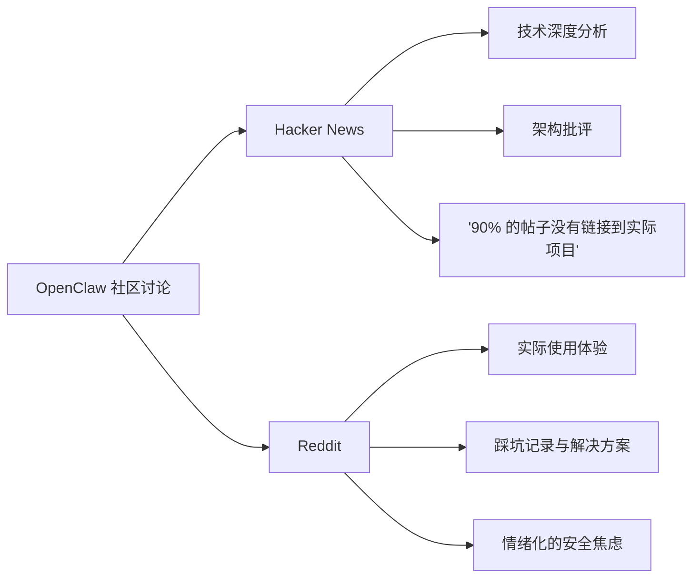

---
tags:
  - OpenClaw
  - Reddit
  - 社区讨论
aliases:
  - Reddit 讨论
  - OpenClaw Reddit
---

# OpenClaw Reddit 社区讨论

**一句话总结**：Reddit 是 OpenClaw 普通用户的"真实体温计"——与 Hacker News 的技术精英视角不同，这里能听到更多真实的使用反馈、踩坑记录和安全焦虑。

## 讨论分布

Reddit 上的 OpenClaw 讨论主要分布在以下子版块：

| 子版块 | 讨论侧重 | 用户群体 |
|--------|----------|----------|
| **r/LocalLLaMA** | 本地模型运行体验、Ollama 配置 | 本地部署爱好者 |
| **r/ChatGPT** | 与 ChatGPT 的功能对比 | ChatGPT 用户 |
| **r/artificial** | AI 安全与伦理讨论 | AI 关注者 |
| **r/selfhosted** | 部署架构、Docker 配置 | 自托管社区 |

## 主要讨论方向

### 1. 技术讨论：本地模型运行

集中在 Ollama 本地模型运行体验。核心问题包括：
- 哪些模型在本地跑效果最好？（DeepSeek 系列讨论热度最高）
- 本地运行的 Token 消耗与 API 调用的成本对比
- Mac Mini 的配置推荐——与 Mac Mini 全球短缺直接关联

### 2. 安全争论（最热门话题）

安全是 Reddit 讨论中最容易引发激烈辩论的话题，与 [[Gary Marcus 对 OpenClaw 的批评]] 的论点形成呼应：

- **给 Agent shell 访问权限是否安全？** 这是反复出现的问题，涉及 [[安全边界与风险（总览）]] 的核心议题
- **明文密钥风险**：有用户指出 OpenClaw 的 API 密钥存储方式存在安全隐患
- **[[ClawHavoc 事件]]后续**：恶意 Skills 感染率 12%（341 个已标记恶意技能）的消息让社区震动
- 案例-Summer Yue 邮件删除灾难的帖子在 r/artificial 上获得大量讨论

### 3. 替代方案讨论

更轻量的 OpenClaw 替代品是持续话题（参见 [[竞品对比总览]]）：
- Claude Cowork 作为"更安全的选择"被频繁提及
- Claude Code / Cursor 用于编码场景的对比
- 自建轻量 Agent 方案的讨论

## 与 Hacker News 的核心差异

| 维度 | Hacker News | Reddit |
|------|-------------|--------|
| **用户画像** | 技术精英、创业者 | 普通用户、初学者 |
| **讨论深度** | 架构设计、安全模型分析 | 使用体验、配置问题 |
| **情绪倾向** | 冷静批判 | 更情绪化（兴奋或恐慌） |
| **核心张力** | "技术上没什么新颖" vs "实际很好用" | "好酷啊" vs "这安全吗" |

## 核心洞察

1. **Reddit 是 OpenClaw 用户增长的晴雨表**——当 r/LocalLLaMA 的讨论热度上升时，通常对应 npm 下载量的增长
2. **安全焦虑是阻碍主流采用的最大障碍**——Reddit 用户比 HN 用户更直接地表达恐惧，这反映了普通用户的真实心态
3. **替代方案讨论的热度说明市场还不成熟**——当用户频繁讨论替代品时，说明 OpenClaw 尚未建立不可替代的护城河（这也是 [[OpenClaw 商业模式]] 面临的核心挑战）
4. **中文社区的 Reddit 替代品**（小红书、知乎）上同样出现了热烈讨论，说明 OpenClaw 的传播已超越英语世界

## 相关笔记

- [[OpenClaw Hacker News 社区讨论]]
- [[OpenClaw 社区活动与生态]]
- [[竞品对比总览]]

## 外部链接

- [Reddit r/OpenClaw](https://reddit.com/r/OpenClaw)
- [OpenClaw GitHub](https://github.com/anthropics/openclawx)
- [Hacker News](https://news.ycombinator.com)

> 来源：Reddit r/LocalLLaMA、r/ChatGPT、r/artificial 社区讨论
