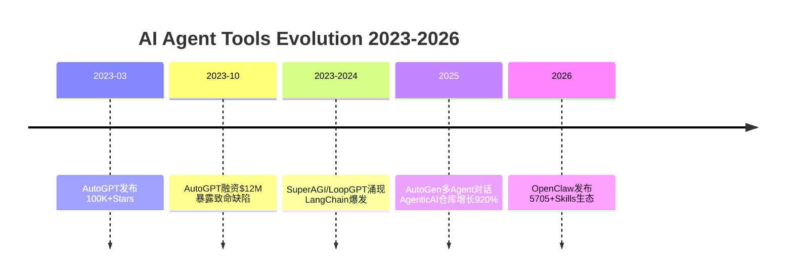

---
tags:
  - Agent
  - 历史
  - 技术演进
aliases:
  - Agent进化史
  - AutoGPT进化
---

# AutoGPT 到 OpenClaw 进化史

## AutoGPT 的爆发与困境

2023 年 3 月 30 日，Toran Bruce Richards 发布 AutoGPT，成为首个广泛展示 GPT-4 自主能力的开源项目。迅速获得 **100K+ GitHub stars**，登顶 GitHub Trending。

致命弱点：
- **经常陷入无限循环**
- 产生幻觉信息
- 递归调用 API 导致运营成本高昂（参见 [[API 定价与成本分析]]）

AutoGPT 的炒作-幻灭曲线是 [[OpenClaw 投资风险因素]] 中投资者最需要警惕的历史先例——同样的叙事弧线可能再次上演。

> "They just don't work. They don't have enough intelligence..."
> — Andrej Karpathy

2023 年 10 月，AutoGPT 母公司 Significant Gravitas 完成 **$12M 融资**。

## 中间框架涌现（2023-2025）

| 框架 | 定位 |
|------|------|
| **SuperAGI** | AutoGPT 的"企业级"替代 |
| **LoopGPT** | 轻量级、模块化 Agent |
| **LangChain / LangGraph** | Agent 编排基础设施，集成进 160 万+ 仓库 |
| **CrewAI** | 多 Agent 协作框架 |
| **AutoGen**（Microsoft） | 多 Agent 对话框架 |

GitHub 上 [[Agentic AI]] 仓库从 2023 年到 2025 年中增长了 **920%**。

## OpenClaw：解决前辈核心缺陷

| 维度 | AutoGPT（2023） | OpenClaw（2026） |
|------|----------------|-----------------|
| **循环控制** | 经常陷入无限循环 | 结构化 [[Agent-Flow-Loop 原理|Agent Flow Loop]] |
| **接口** | 终端命令行 | WhatsApp / Telegram |
| **记忆** | 每次会话重置 | 持久[[记忆系统|记忆]] + 上下文管理 |
| **工具** | 基础网页浏览/文件 | 5,705+ [[Skills 市场|Skills]] 生态 |
| **运行模式** | 手动触发 | 24/7 持续运行（Heartbeat 监控） |
| **模型** | 仅 GPT-4 | [[模型无关架构]] |

> **"The difference isn't intelligence — it's architecture."**

Agent 的突破不在于等待更聪明的模型，而在于构建更好的架构。

## AI Agent 工具演进时间线

## 相关笔记

- [[Agent-Flow-Loop 原理]]
- [[模型无关架构]]
- [[2026 Agent 元年]]
- [[Toran Bruce Richards]] — AutoGPT 的创建者

## 外部链接

- [OpenAI](https://openai.com)
- [Anthropic](https://anthropic.com)
