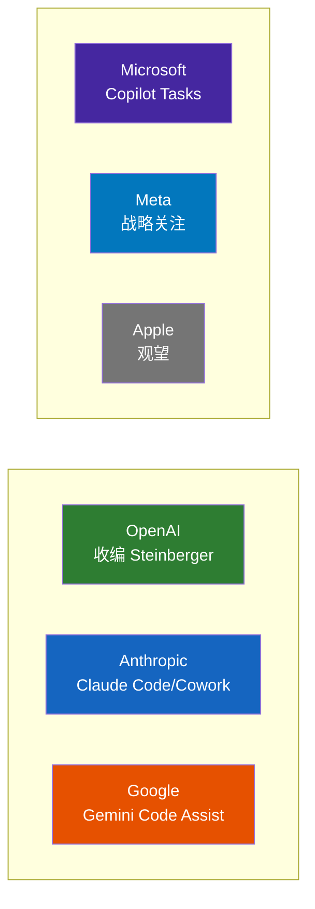

---
tags:
  - 竞争
  - 大厂
  - Agent
aliases:
  - Agent竞赛
  - 大厂Agent布局
---

# 大厂 Agent 竞赛

## 各大厂 Agent 布局对比

## 各公司布局

| 公司 | Agent 产品 | 状态 |
|------|-----------|------|
| **OpenAI** | 收编 [[Peter Steinberger]]，Agent 战略核心化 | 进行中 |
| **Anthropic** | Claude Code + Claude Cowork | 已发布 |
| **Google** | Gemini Code Assist + Project Mariner | 迭代中 |
| **Microsoft** | Copilot Tasks（"会自动执行的待办列表"） | 研究预览 |
| **Meta** | 未公开具体 Agent 产品，Zuckerberg 亲自联系 Steinberger | 战略关注 |
| **Apple** | 未知 | 观望 |

## NIST AI Agent 标准计划

美国国家标准与技术研究院启动了 **"AI Agent 标准计划"**，确保下一代 AI Agent 能够安全地代表用户行动。这与安全风险的讨论密切相关。

这意味着 Agent 已经进入了**国家级标准制定的视野**。

## Agentic AI Foundation (AAIF)

2025 年 12 月 9 日，**Linux Foundation** 成立 **Agentic AI Foundation (AAIF)**。

### 三个创始项目

| 项目 | 贡献方 | 定位 |
|------|--------|------|
| **[[MCP 协议|MCP]]**（Model Context Protocol） | Anthropic | AI 模型连接工具/数据的通用标准协议 |
| **goose** | Block | 开源、本地优先的 AI Agent 框架 |
| **AGENTS.md** | OpenAI | AI 编码 Agent 的项目级指导标准 |

### 铂金成员（8 家）

AWS、Anthropic、Block、Bloomberg、Cloudflare、Google、Microsoft、OpenAI

2026 年 2 月 24 日更新：新增 97 名成员，总计达到 **146 家组织**。

> Jim Zemlin："Nearly 150 organizations joining the AAIF in its early days is a strong signal that **agentic AI is shifting from experimentation to real-world deployment**."

[[AAIF 基金会|AAIF]] 的成立意味着 Agentic AI 正在从实验阶段走向**企业基础设施**阶段。

## 相关笔记

- [[MCP 协议]]
- [[竞品对比总览]]
- [[多 Agent 竞争格局]]
- [[2026 Agent 元年]]
- [[商业化路径]]

## 外部链接

- [OpenAI](https://openai.com)
- [Anthropic](https://anthropic.com)
- [Gartner AI](https://www.gartner.com/en/topics/artificial-intelligence)
