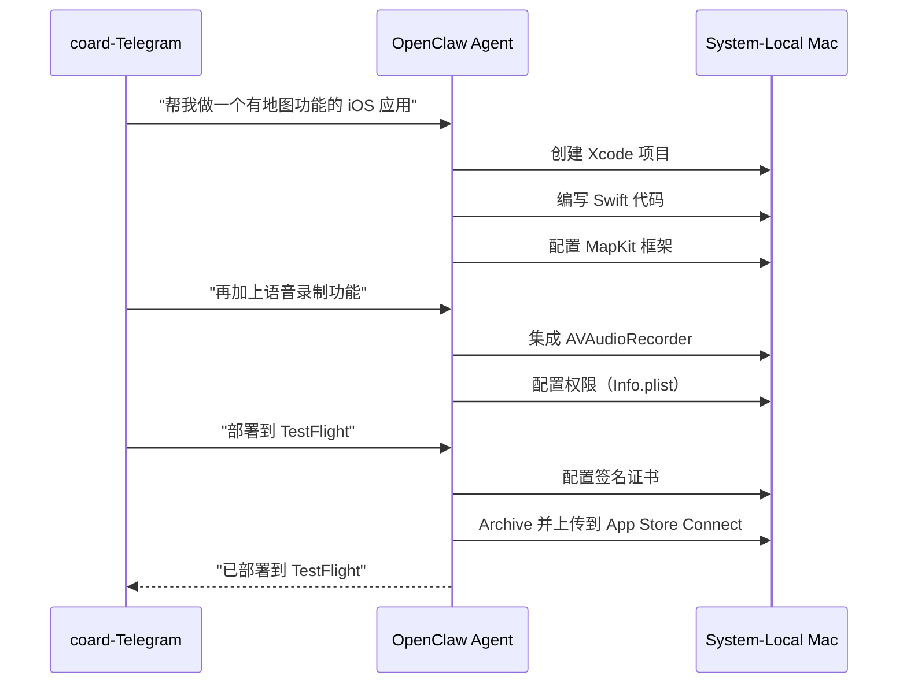
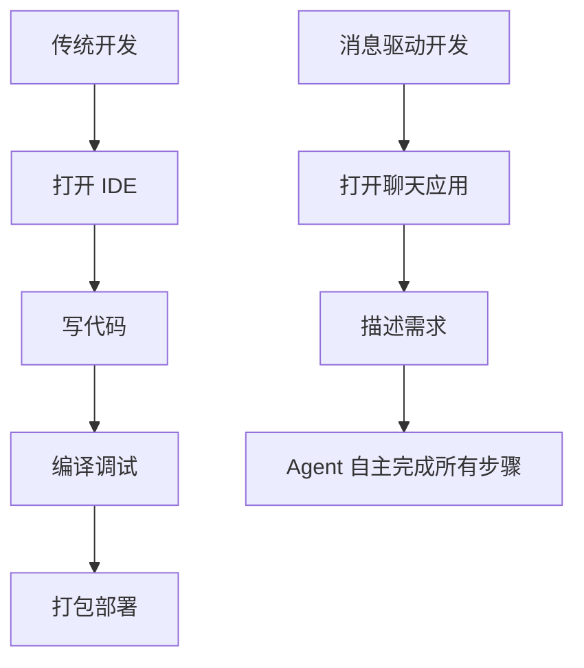

---
tags:
  - 案例
  - iOS开发
  - 非技术人员
  - Telegram
  - OpenClaw
aliases:
  - Telegram开发iOS
  - 聊天式编程
---

# 案例：Telegram 聊天开发 iOS 应用

**人物**：@coard
**案例**：通过 Telegram 对话完成了一个完整的 iOS 应用开发

**一句话总结**：一个人通过 Telegram 聊天就完成了 iOS 应用的从编码到 TestFlight 部署——全程没有打开 Xcode 或终端，这是"消息驱动开发"范式的极端案例。

## 成果详情

| 维度 | 详情 |
|------|------|
| **应用功能** | 地图功能 + 语音录制 |
| **部署** | 成功上传至 TestFlight |
| **开发工具** | 仅 Telegram（OpenClaw 消息集成） |
| **未使用的工具** | Xcode、终端、任何 IDE |
| **技术栈** | iOS（Swift/SwiftUI 推测） |

## 开发流程还原

这个流程的惊人之处在于：
1. **@coard 从未打开 Xcode**——Agent 在后台操作 Xcode 命令行工具（xcodebuild）
2. **从未打开终端**——所有系统命令通过 Agent 的 shell 访问执行
3. **纯自然语言交互**——需求描述 → 代码生成 → 编译 → 签名 → 部署全流程

## 技术难度分析

这个案例的技术复杂度远超表面：

| 步骤 | 传统方式 | Agent 自主完成 |
|------|---------|---------------|
| 创建项目 | Xcode GUI 操作 | xcodebuild 命令行 |
| 集成 MapKit | 手动导入框架、配置权限 | 自动修改 Info.plist 和项目配置 |
| 语音录制 | 处理 AVAudioSession、权限请求 | 完整实现录音逻辑和权限处理 |
| 代码签名 | 配置开发证书、Provisioning Profile | 自动处理签名流程 |
| TestFlight 部署 | Archive → Organizer → Upload | altool 或 Transporter 命令行上传 |

其中**代码签名和 TestFlight 部署**是最困难的部分——即使是经验丰富的 iOS 开发者也经常在这一步遇到问题。

## 意义：消息驱动开发（Message-Driven Development）

这是 [[编程民主化]] 的极端案例，也是 [[Agentic Coding]] 的经典场景——通过聊天完成完整应用开发，从编码到部署的全流程无需人工触碰代码。体现了 Agent-Flow-Loop 原理中 Agent 自主完成复杂任务链的能力，也是 自主执行与人机协作 的生动示范。

关键特征：
- **零 IDE 依赖**：开发者不需要安装或打开任何 IDE
- **自然语言接口**：需求以对话形式传达，而非代码
- **全流程自动化**：从编码到部署的每个步骤都由 Agent 自主完成

## 与其他 "Vibe Coding" 案例的对比

| 案例 | 技术背景 | 工具 | 成果 |
|------|---------|------|------|
| **本案例** | 未知 | Telegram + OpenClaw | iOS 应用（地图+语音） |
| [[案例-Ken Yeung 的 Vibe Coding]] | "largely non-technical" | OpenClaw 生态工具 | ClawBeat.co 聚合平台 |
| [[案例-Jesse Genet 家庭教育系统]] | 非技术背景 | OpenClaw（"从未打开终端"） | 儿童电视 APP |

这些案例一起展示了 Agentic Coding 如何让"不打开 IDE"也能构建产品成为现实。

## 核心洞察

1. **"全程没有打开 Xcode"不是噱头，而是范式转移的信号**——当开发者可以通过聊天完成完整的 iOS 开发流程时，IDE 的角色需要被重新定义
2. **Telegram 作为开发界面揭示了 Agent 的真正力量**——不是"用更好的 IDE"，而是"不需要 IDE"
3. **代码签名和 TestFlight 部署的自主完成是最令人印象深刻的部分**——这些是经验丰富的开发者都经常踩坑的环节
4. **这个案例是 Agent-Flow-Loop 原理的完美演示**——Agent 接收高层目标，自主分解为子任务，逐步完成整个任务链
5. **局限性值得注意**：这是一个功能简单的应用，对于复杂的 iOS 项目（大规模状态管理、自定义动画、性能优化），纯聊天开发可能不够

## 相关笔记

- [[编程民主化]]
- [[案例-Ken Yeung 的 Vibe Coding]]
- [[案例-Jesse Genet 家庭教育系统]]
- [[Agent-Flow-Loop 原理]]

## 来源

- [OpenClaw Showcase](https://docs.openclaw.ai/start/showcase)
- [X 原帖 - @coard](https://x.com/coard)
- [Hacker News Discussion](https://news.ycombinator.com)
