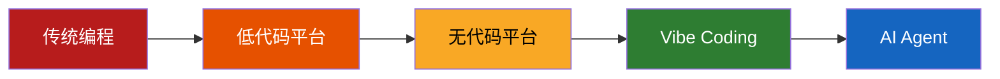

---
tags:
  - 趋势
  - 无代码
  - 低代码
aliases:
  - No-Code
  - Low-Code
---

# 低代码与无代码趋势

[[OpenClaw 是什么|OpenClaw]] 代表了无代码趋势的最新演进——从拖拽式界面到**自然语言驱动**。这一趋势与 Agentic AI 的发展密不可分。

## 演进路径

1. **传统编程**：手写全部代码
2. **低代码平台**：拖拽组件 + 少量代码（如 Mendix、OutSystems）
3. **无代码平台**：纯可视化操作（如 Bubble、Webflow）
4. **Vibe Coding**：自然语言描述意图，AI 生成代码（详见 [[Vibe Coding]]）
5. **AI Agent**：自然语言对话，AI 直接执行任务（OpenClaw），通过 Tool Use 机制与外部系统交互

## OpenClaw 的差异

OpenClaw 超越了传统低代码/无代码的范畴，实现了 [[可及性突破]]：
- 不只是"不写代码"，而是"不需要关心代码是否存在"
- 从"AI 帮你写代码"到"AI 替你做事"——这正是 [[Agentic Coding]] 的核心转变
- 界面是聊天应用，而非专门的开发平台，背后的 LLM 承担了代码生成任务
- 模型无关架构让用户可选择最适合自己的模型，包括开源模型

## 宏观数据支撑

- 41% 全球代码由 AI 生成（详见 AI 代码生成宏观数据）
- 25% YC 2025 冬季批次公司的代码库 95%+ 由 AI 生成
- Gartner 预测到 2026 年底 40% 企业应用集成 AI Agent

## 相关笔记

- [[编程民主化]]
