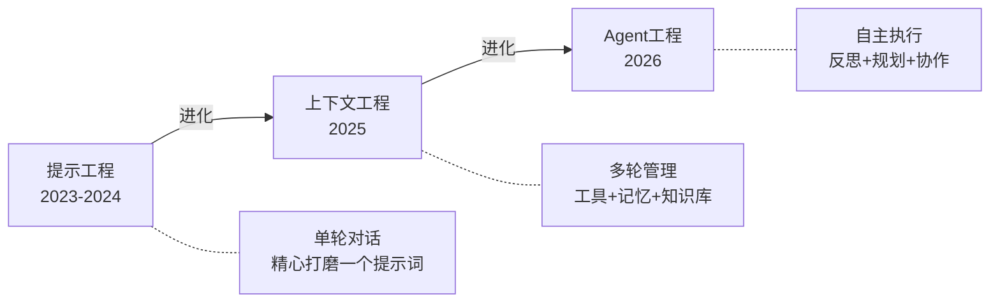

# 提示工程

## 一句话解释

提示工程就像学会跟一个极其聪明但完全不了解你的实习生沟通——你说话的方式、给出的例子、设定的边界，直接决定了它输出的质量。

## 核心技巧

| 技巧 | 原理 | 类比 |
|------|------|------|
| **Zero-shot** | 直接提问，不给例子 | "帮我翻译这句话" |
| **Few-shot** | 给2-3个示例再提问 | "这是几个翻译范例，请按同样风格翻译" |
| **Chain of Thought** | 要求模型展示推理步骤 | "一步一步想，先...然后..." |
| **System Prompt** | 设定角色和行为边界 | "你是一个资深法律顾问" |
| **Persona** | 让模型扮演特定角色 | "假设你是Linus Torvalds" |

这些技巧的本质是同一件事：**为模型提供更精确的上下文**，缩小它的输出空间，让回答落在你想要的区域内。

## 从提示工程到Agent工程的范式转变

2026年，AI领域正在经历一次决定性的转变：

- **提示工程时代**（2023-2024）：核心工作是打磨一个完美的提示词，让模型一次给出最佳回答
- **上下文工程时代**（2025）：管理工具访问、知识库、系统指令和记忆，让模型在多轮对话中保持一致
- **Agent工程时代**（2026）：设计自主决策循环，让 Agent 自己规划、执行、反思、迭代

## 为什么"不仅仅是提示工程问题"

[[OpenClaw 是什么|OpenClaw]] 和整个 [[Agentic AI]] 范式的核心论点是：**单靠提示词永远无法编码所有业务规则，也无法预判所有突发情况**。

一个Agentic架构给AI赋予了持久的"目的"和上下文，而提示工程只能处理单次交互。这就像是——提示工程是教一个人怎么回答面试问题，Agent工程是给一个人一份工作说明书、一间办公室和一套工具，然后让他自己干活。

## 但提示工程并没有死

Andrew Ng提出的Agent设计四大能力——**反思、工具使用、规划、多Agent协作**——每一个环节内部仍然依赖精心设计的提示词。区别在于：
- 提示工程师变成了**上下文架构师**
- 提示词不再是手动输入的，而是Agent系统在运行时自动组装的
- 你设计一次，Agent复用千万次

最有效的2026年AI策略：Agent处理80%需要一致性的工作，提示工程打磨20%需要卓越的工作。这也解释了为什么 Vibe Coding 和编程民主化浪潮中，用户不需要精通提示工程就能通过 Agentic Coding 完成复杂任务。

## 对 System Prompt 设计的影响

在Agent系统中，System Prompt不再是"一段开头指令"，而是Agent人格、能力边界、安全护栏的**宪法**。OpenClaw 的System Prompt设计直接决定了Agent是一个有用的助手还是一个失控的脚本。Prompt Injection 的存在使得 System Prompt 的防御性设计变得尤为关键。

## 双链

- [[Agent Execution Loop]]
